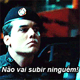

# 🦑 :octocat: *Welcome to Anderson's github* :octocat: 🦑

:v: _**You can find me in a lot of places:**_

   

:izakaya_lantern: *I'm a computer science student struggling to be a great programmer!*  

:zap: *Currently, I'm improving my skills with web programming and testing some new frameworks to make my routine more easier* :stuck_out_tongue_winking_eye:

:point_right: *if you are brazilian, you'll understand why my username is cap-nascimento* :grin:

:japanese_ogre: Fun facts about me: I like to play acoustic guitar :musical_note: (just because I don't have any other instrument), I like to watch anime and study japanese on free time, by the way,　プログラミングはすごいですね！

:star: _**Here you'll find awesome things... Like**_ 

:heavy_check_mark: *A Hair Stylist Portfolio*  
:heavy_check_mark: *Web Scrappers*  
:heavy_check_mark: *A lot of useful data structures in C/C++*  
:heavy_check_mark: *Cool personal and job projects (maybe some of them are private)*  
:heavy_check_mark: *Things that comes from my mind and I turn into code* :joy:  

:star: _**My favorite programming languages are...**_

:computer: *C++*, :coffee: *Java*, :snake: *Python*, :sob: *JavaScript*  

<!--
**cap-nascimento/cap-nascimento** is a ✨ _special_ ✨ repository because its `README.md` (this file) appears on your GitHub profile. testando termux

Here are some ideas to get you started:

- 🔭 I’m currently working on ...
- 🌱 I’m currently learning ...
- 👯 I’m looking to collaborate on ...
- 🤔 I’m looking for help with ...
- 💬 Ask me about ...
- 📫 How to reach me: ...
- 😄 Pronouns: ...
- ⚡ Fun fact: ...
-->
